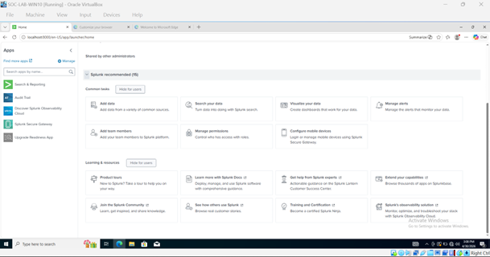
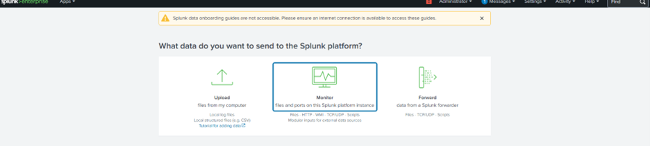
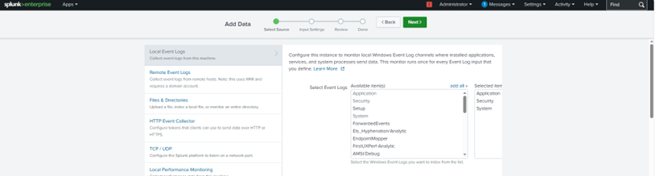
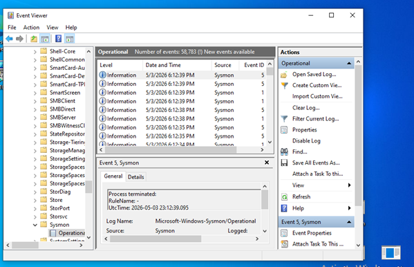
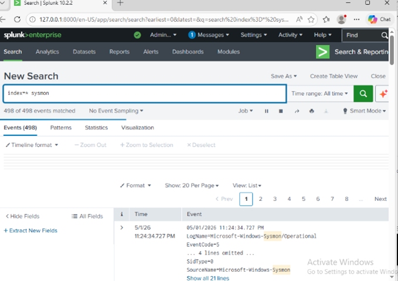
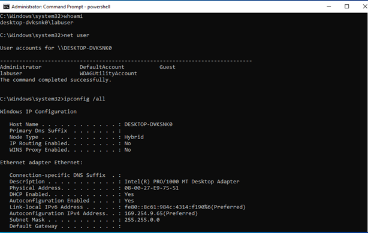
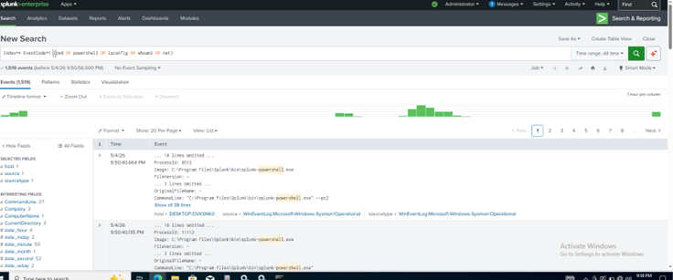

# splunk-siem-lab
Built a Splunk SIEM lab to ingest Windows and Sysmon logs, simulate endpoint activity, and detect process execution using SPL queries.
## Screenshots

### Splunk Dashboard

### Data Input (Monitor)

### Windows Event Logs Selection

### Sysmon Event Viewer

### Sysmon Logs in Splunk

### Detection Query

### Event Analysis

